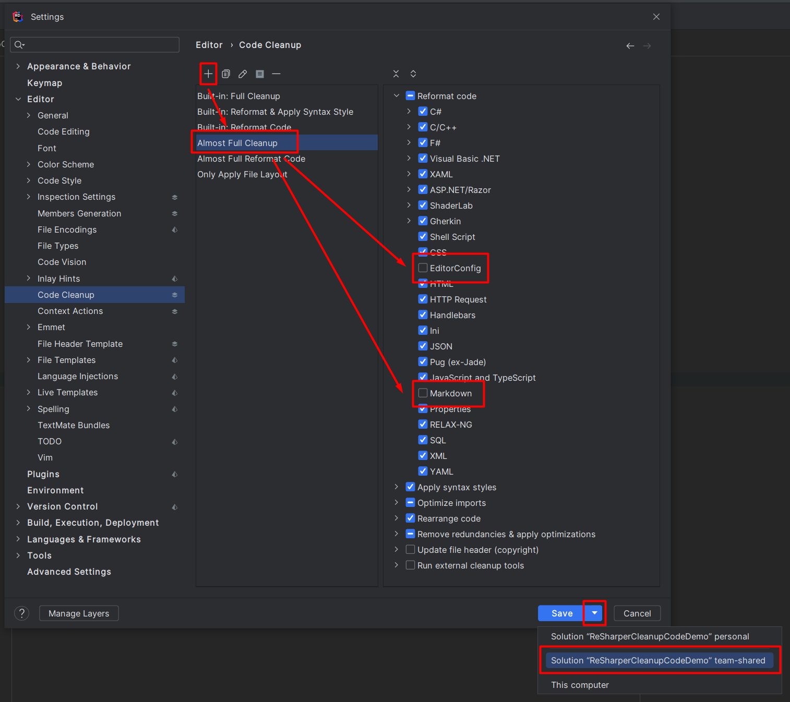
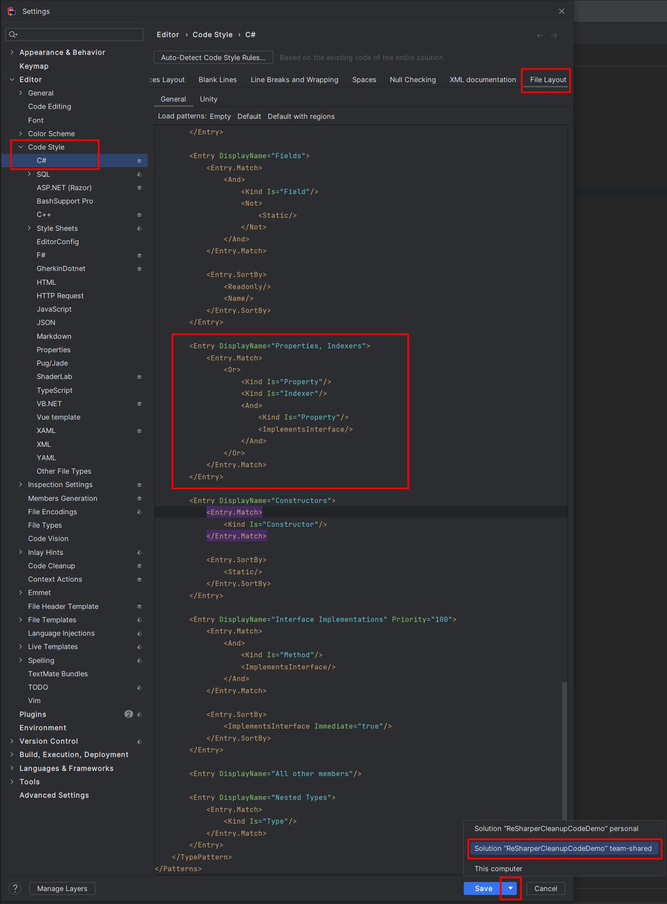

# GitHub Action of ReSharper CLI CleanupCode Demo

#### Action in Marketplace: [ReSharper CLI CleanupCode](https://TODO)
#### Action in Repository: [ArturWincenciak/ReSharper_CleanupCode@v2.0](https://github.com/ArturWincenciak/ReSharper_CleanupCode)

## Try your self
1. Fork this repo
2. Create a Pull Request
3. Go to `Actions` and observe the action in action
4. Check out history of your repo and see newly created commit

## Brief

That is a project uses a GitHub Action that allows you to run 
[ReSharper's CleanupCode Command-Line Tool](https://www.jetbrains.com/help/resharper/CleanupCode.html) in order to
automatically apply code style rules and reformat code in a project. The action is triggered on a push event, and it
cleans up the code using the specified profile, and commits the changes with a specified commit message.

Note that this code includes an example class `DemoClass` that break some style rules and a unit test class `DemoUnitTests`, 
which also brake rules but is used to demonstrate how the action can be configured to exclude certain types of code from being 
cleaned up.

## Usage [cleanup_code.yml](https://github.com/ArturWincenciak/ReSharper_CleanupCode_Demo/blob/main/.github/workflows/cleanup_code.yml)


```yaml
name: ReSharper CLI CleanupCode

on: [ push ]

jobs:
  cleanup:
    runs-on: ubuntu-latest
    name: Cleanup Code
    
    steps:
      - name: Checkout
        uses: actions/checkout@v3

      - name: Setup .NET
        uses: actions/setup-dotnet@v3
        with:
          dotnet-version: 7.0.x

      - name: Restore Dependencies
        run: dotnet restore ReSharperCleanupCodeDemo.sln
          
      - name: Cleanup Code
        id: cleanup
        uses: ArturWincenciak/ReSharper_CleanupCode@v4.14
        with:
          solution: 'ReSharperCleanupCodeDemo.sln'
          fail_on_reformat_needed: 'no'
          auto_commit: 'yes'
          jb_cleanup_code_arg: '--verbosity=INFO --profile=Built-in: Full Cleanup --exclude=**UnitTests/**.*'
          commit_message: 'Cleanup code by ReSharper CLI CleanupCode GitHub Action'
          commit_creator_email: 'cleanup@up.action'
          commit_creator_name: 'Clean Up'
```
### Here you have sequence of steps

- `Checkout`: download the source code from the current repository where the Action was
  initiated
- `Setup .NET`: install the specified version of .NET on the virtual machine where the Action is run
- `Restore Dependencies`: restore all project dependencies, such as NuGet libraries
- **`Cleanup Code`: clean up the code action**

The last step, named **`Cleanup Code`**, is the one that is most relevant to us here.

### Configure the command-line tool parameters

Using action input `jb_cleanup_code_arg` for instance like down below
you can configure CleanupCode with command-line parameters as it is described
here in **[clear and concise specification](https://www.jetbrains.com/help/resharper/CleanupCode.html#command-line-parameters)**.

```yaml
jb_cleanup_code_arg: '--verbosity=INFO --profile=Almost Full Cleanup --exclude=**UnitTests/**.*'
```
Here has been used `--exclude` parameter to exclude unit test code from being cleaned up and `--profile` to choose
on of my custom configuration stored in team shared `ReSharperCleanupCodeDemo.sln.DotSettings` settings.

## The simplest way to usage

```yaml
steps:
  - name: Cleanup Code
    uses: ArturWincenciak/ReSharper_CleanupCode@v2.0
    with:
      solution: 'ReSharperCleanupCodeDemo.sln'
```

### To learn more, please visit [specification in the marketplace](TODO)

## Shared team configuration

### Solution team-shared settings in `*.sln.DotSettings`

All your setting should be saved in ['Solution team-shared' layer](https://www.jetbrains.com/help/rider/Sharing_Configuration_Options.html#solution-team-shared-layer).
In this project here is the file: [ReSharperCleanupCodeDemo.sln.DotSettings](https://github.com/ArturWincenciak/ReSharper_CleanupCode_Demo/blob/main/ReSharperCleanupCodeDemo.sln.DotSettings).

### Export code style settings to `.editorconfig`

Read more here:
- [Use EditorConfig](https://www.jetbrains.com/help/rider/Using_EditorConfig.html)
- [Export code style settings to EditorConfig](https://www.jetbrains.com/help/rider/Using_EditorConfig.html#export-code-style-settings)

I suggest exporting all settings, including default settings, to a [.editorconfig](https://github.com/ArturWincenciak/ReSharper_CleanupCode_Demo/blob/main/.editorconfig) file. It is important to explicitly
save all default settings to avoid potential issues in the future caused by changes in default settings in newer
versions of the software. It is important to explicitly save all default settings in a transparent manner.

### Set up your `--profile`

Read more here: 
- [Code cleanup profiles ](https://www.jetbrains.com/help/rider/2022.3/Code_Cleanup__Index.html#profiles)

As you can see in the [cleanup_code.yaml](https://github.com/ArturWincenciak/ReSharper_CleanupCode_Demo/blob/main/.github/workflows/cleanup_code.yml) file:

```yaml
jb_cleanup_code_arg: '--verbosity=INFO --profile=Almost Full Cleanup --exclude=**UnitTests/**.*'
```

one of the settings is the `--profile` flag. I have set my profile to be named `Almost Full Cleanup`.

I have configured my profile to exclude `*.md` files and the `.editorconfig` file from the cleanup."



### Set up your type layout patterns

Read more here:
- [Rearrange members with file and type layout patterns](https://www.jetbrains.com/help/rider/File_and_Type_Layout.html)

My current favorite setting looks like this ([ReSharperCleanupCodeDemo.sln.DotSettings](https://github.com/ArturWincenciak/ReSharper_CleanupCode_Demo/blob/main/ReSharperCleanupCodeDemo.sln.DotSettings)):



## Clean up your code in local repo

- **[local-dev-cleanup-code.sh](https://github.com/ArturWincenciak/ReSharper_CleanupCode_Demo/blob/main/local-dev-cleanup-code.sh)**

In this repository I have prepared a ready-made script `local-dev-cleanup-code.sh` that you can run locally. 
That script will perform clean up code and create a commit with the changes in your local repository.

This is an additional feature that allows you to push the commit to the remote repository by your self and avoiding the
need to `pull` automatically created commit on the remote repository. This can save you the hassle of resolving conflicts 
in case you have made changes to the same file locally in the meantime.

This will save your time from having to enter a commit message each time. 
The commit with the changes will be created automatically.

Feel free to use the script and perform clean up your code locally with a fully automated commit and save your time.

_That script can be configured as git commit hook but ... TBD_

### How to run the script 

First of all remember to add the required 
[manifest file](https://github.com/ArturWincenciak/ReSharper_CleanupCode_Demo/blob/main/.config/dotnet-tools.json) 
and then run that commands:

```bash
dotnet tool restore
dotnet tool update --global JetBrains.ReSharper.GlobalTools
source .bashrc
```

### Next time you can just call

```bash
cc
```
### Clean up code and leave the changes in your working copy without commit

```bash
cc -a no
```